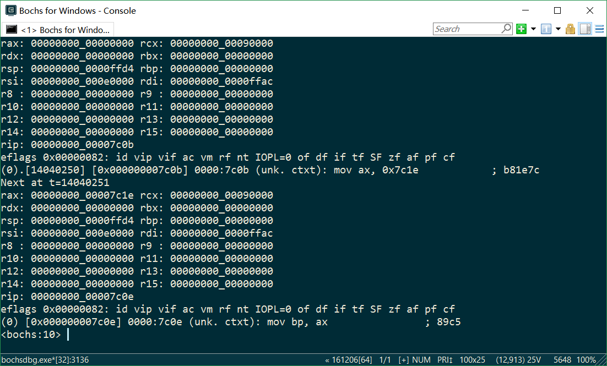
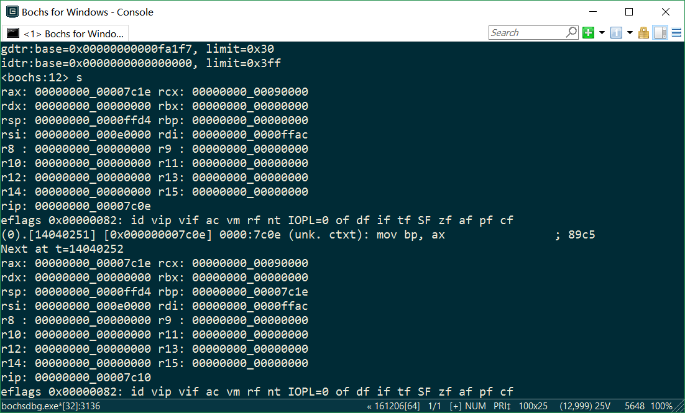
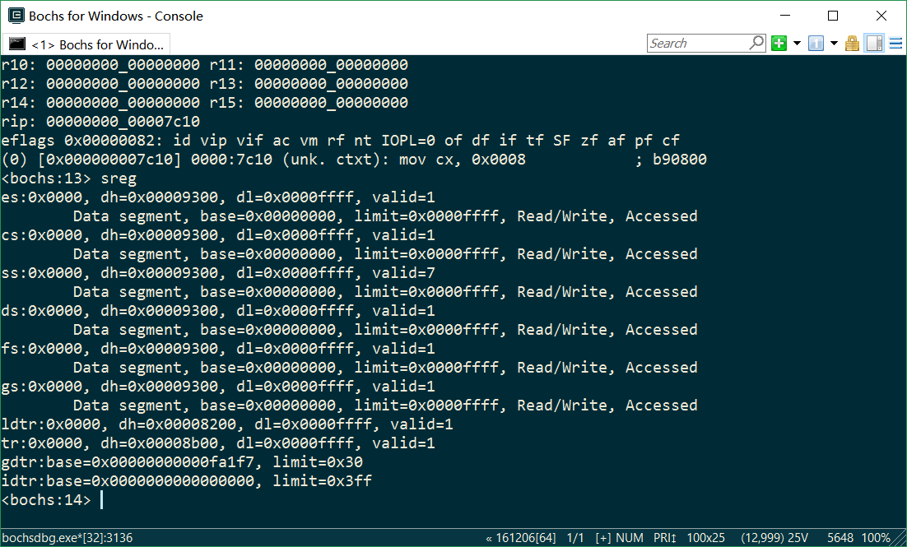
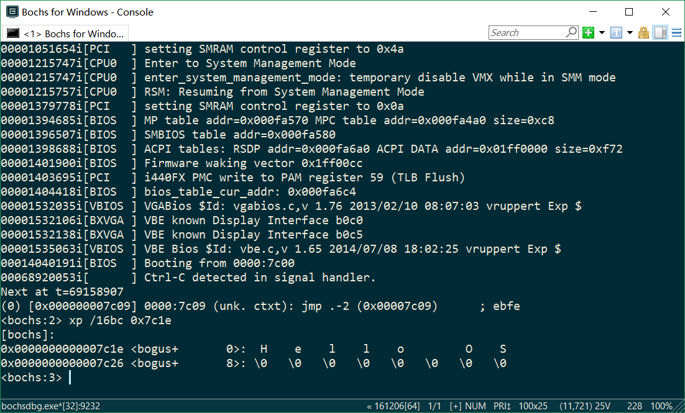

# 1.3 代码阅读 实验验证
---
## 概述
调用 `int 10h` 时，`ah = 13` 代表调用写字符串功能，此时 `es:bp` 的值作为字符串的地址。

执行 `mov ax, cs` 和 `mov es, ax` 后，`es` 的值被设为 `cs` 的值，即代码段的起始地址。

执行 `mov ax, BootMessage` 后，`ax` 中的值为 `BootMessage` 相对于代码段（`cs`）的偏移量（相对地址），即 `0x7c1e` .

执行 `mov bp, ax` 后，`BootMessage` 的偏移量进入 `bp` 中，此时由于 `es = cs = 0`，`es:bp` 恰好为 `BootMessage` 在内存中的位置（绝对地址）。

## 实验过程
### 使用 bochsdbg 调试到 `mov ax, BootMessage` 执行后：

可见 `ax = 0x7c1e` .

### 继续调试到 `mov bp, ax` 执行后：

可见 `bp = 0x7c1e` .

### 查看段寄存器的值：

可见 `cs = 0`，`es = 0` .

### 查看内存 `0x7c1e` 处的内容：

可见物理地址 `0x7c1e` 处的内容为 `"Hello OS"` .

## 结论
综上所述，`bp` 内存放的是 `BootMessage` 的相对地址，由于 `es = cs = 0`，`es:bp` 恰好为 `BootMessage` 的绝对地址。
