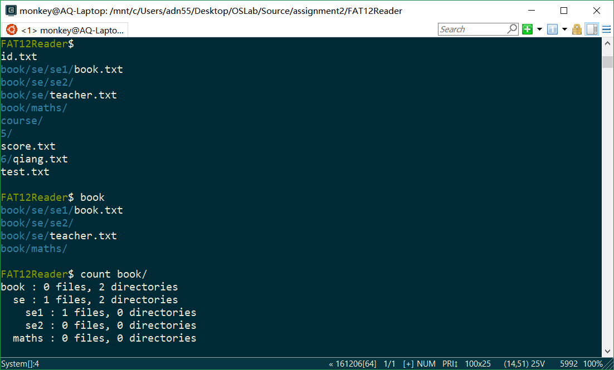
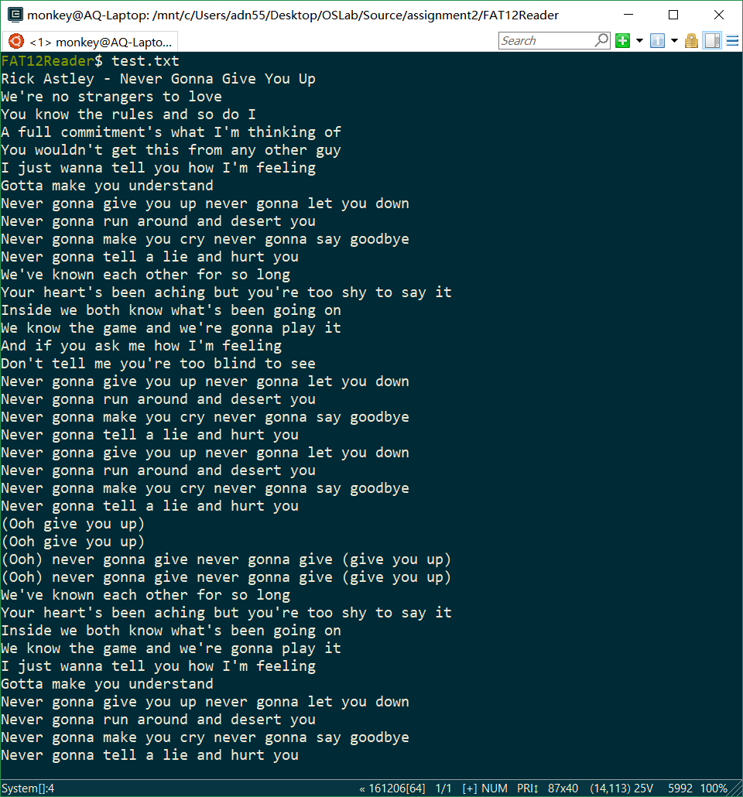

# 操作系统实验二 说明文档
---
## 提交文件清单
- main.c
- my_print.asm
- Makefile

## 编译指令（运行环境：Linux 64-bit）
- `make`：编译
- `make run`：编译并运行

## 功能点覆盖
✅ 程序运行时，打印所有文件的路径
✅ 输入路径，分别对目录、普通文件、不存在文件做出不同的响应
✅ 输入 `count 路径`，输出该路径及子目录的文件和子目录数量
✅ 输入 `exit` 退出程序
✅ 支持打印超过 512B 的文件
✅ 支持在输入错误时给出提示
✅ 不显示隐藏文件，不区分大小写

## 运行截图
### 基本功能

### 输出超过 512B 的文件
